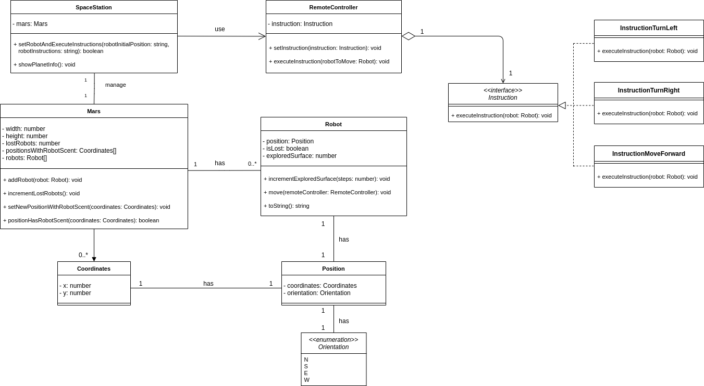

# Martian Robots

This project has been developed to resolve the Martian Robots coding challenge. Here, you can find information about solution details and how to run the program.

**The project has been developed with TypeScript**.

# Table of contents
1. [How to run the project](#how-to-run-the-project)
   1. [(Optional) Store data in MongoDB](#optional-store-data-in-mongodb)
   2. [Execute script](#execute-script)
2. [General information](#general-information)
   1. [Input](#input)
   2. [Output](#output)
3. [System design](#system-design)
   1. [Strategy design pattern](#strategy-design-pattern)
4. [Input format validation](#input-format-validation)
5. [MongoDB stored information](#mongodb-stored-information)
   1. [Information and examples](#information-and-examples)
   2. [Technologies](#technologies)
6. [Testing](#testing)
   1. [Test cases](#test-cases)

## How to run the project

Here you can find information about how to run the project in your machine.

### (Optional) Store data in MongoDB

If you want to see stored data in MongoDB, previously you have to create a Docker container. Run the following command:
```
sudo docker run --name martian_robots -d -p 127.0.0.1:27017:27017 mongo
```

### Execute script

Clone the content of this repository (clone or download it). 

Inside the `/input/` directory, you will find a `input.txt` file. You can edit it to have different executions of the script. Read the [input](#Input) section of this document to find more information about how to properly edit this file.

Then, in the root directory, execute this commands:

```
> npm i
> npm run start
```

Finally, you will have the results of the execution in the `output.txt` file inside the `/output/` directory, as well as stored data in MongoDB if you started the container as aforementioned.

## General information

Our Space Station has discovered **Mars**, a bidimensional planet where our robots can land and move on their own (following our instructions). Unfortunately, our robots can fall into space while they are travelling around the planet, getting lost forever. However, a place where a robot has been lost, is a place where no more robots will be lost, as they can recognize where a mate has fallen, avoiding tripping over the same stone twice.

### Input

The program input is a text file (`/input/input.txt`) where information about planet and robots is located. You must provide:
* Planet upper-right coordinates.
* Robot initial position and orientation.
* Robot instructions (a robot can turn left (L), turn right (R) or move forward (F)).

An example would be:
```
5 3
1 1 E
RFRFRFRF
3 2 N
FRRFLLFFRRFLL
```

This input represents:
- A planet of size 6x4, whose:
  - lower-left coordinates are `(0,0)`
  - upper-right coordinates are `(5,3)`
- One robot which is located in `(1,1)`, looking **east**. Its instructions are `RFRFRFRF`.
- Another robot which is located in `(3,2)`, looking **north**. Its instructions are `FRRFLLFFRRFLL`.

The system only starts if the planet information is properly present on this input. In addition, both positions and instructions lines must be properly formatted; otherwise, they will be simply ignored.

The system, after finding a valid pair of position and instructions, **will set a new robot and execute its instructions** before looking for new robots positions/instructions.

### Output

After robots have executed all the instructions, the system will save the final position of every robot in a text file (`/output/output.txt`). For each robot, there will be information about:
- Robot final coordinates and orientation.
- Information about lost robots.

For example, the output corresponding to the previous input would be:
```
0 1 N 
3 3 N LOST
```

Furthermore, some extra information will be stored in a Mongo database. This will be explained in detail later.

## System design

The developed system has the following classes:



### Strategy design pattern

The **Strategy design pattern** has been selected for implementing the robots instructions, as more instructions could be added in the future.

- `RemoteController` class acts as the **context** class. This class will be used by the Space Station to indicate a robot which instruction has to be executed.
- What a instruction means for a robot is defined along the implementation classes (`InstructionTurnLeft`, `InstructionTurnRight` and `InstructionMoveForward`).
- If a new instruction is added, the required steps are:
  - Create a new implementation class which defines what means that new instruction for a robot.
  - In the `constants.ts` file, add the string representation of the new instruction in the Dictionary and edit the regular expression that controlles the input format.

The function `incrementExploredSurface()` of the Robot class allow us to easily keep consistent robot information when creating new instructions for taking steps.

## Input format validation

The input file has some validation in order to control the content of the file. This validation is carried out thanks to some regular expressions.

Validations are:

- The planet upper-right coordinates must appear in the first line of the file. In addition, only two numbers (**separated by one space**) between 1 and 50 are allowed. If the format is valid but the coordinates are out of range, the number will be replaced by 50.
- The initial position must have three characters separated by one space:
  - Coordinates must be two numbers, and their value must be: `0 <= value < planetSize` (planetSize is the planet width for X coordinate, planet height for Y coordinate).
  - Orientation must be one of the following characters: 'N', 'S', 'E', 'O'.
- The instructions must be a uppercase string, whose maximum length must be 100 and only can contain the following characters: 'L', 'R', 'F'.

A line which does not match any of these rules will be ignored. Also, a robot is only set when one valid line of position and one valid line of instructions are found. 

The following regular expression have been used:
- Planet size: `^\\d+\\s{1}\\d+$`
- Position: `^\\d+\\s{1}\\d+\\s{1}[NSEW]{1}$`
- Instructions: `^[FLR]{1,100}$`

## MongoDB stored information

Using MongoDB, each running of the program saves documents which contain information about final state of both robots and Mars.

### Information and examples

Robot documents:
- Final position of the robot (coordinates and orientation).
- Whether a robot has been lost or not.
- Total amount of cells explored.

Example:


Mars documents:
- Width and height of the planet.
- Total amount of lost robots.
- Coordinates with robot scent.

Example:


### Technologies

- **[Typegoose](https://github.com/typegoose/typegoose)** is used for modeling the classes Robot and Mars in order to be stored on MongoDB.
- A docker container is used to have a MongoDB instance running.

## Testing

**[Mocha](https://mochajs.org/)** is the framework selected for testing. You can run tests using the command:

```
> npm test
```

on project root directory.

### Test cases
- Position is created correctly
- Turn left a robot.
- Turn right a robot.
- Move a robot one step forward.
- Move a robot for some given instructions.
- Robot does not move as it does not receive any instruction.
- Mars is created correctly.
- One robot is added correctly to Mars.
- Increment correctly the number of lost robots in Mars.
- Set correctly a new position with robot scent.
- Check correctly if a given position has already robot scent or not.
- Set one robot, execute its instructions (without falling) and keep correct status.
- Set one robot, execute its instructions (falling) and keep correct status.
- Set two robots, execute their instructions (without falling) and keep correct status.
- Set three robots, execute their instructions (one robot falling) and keep correct status.